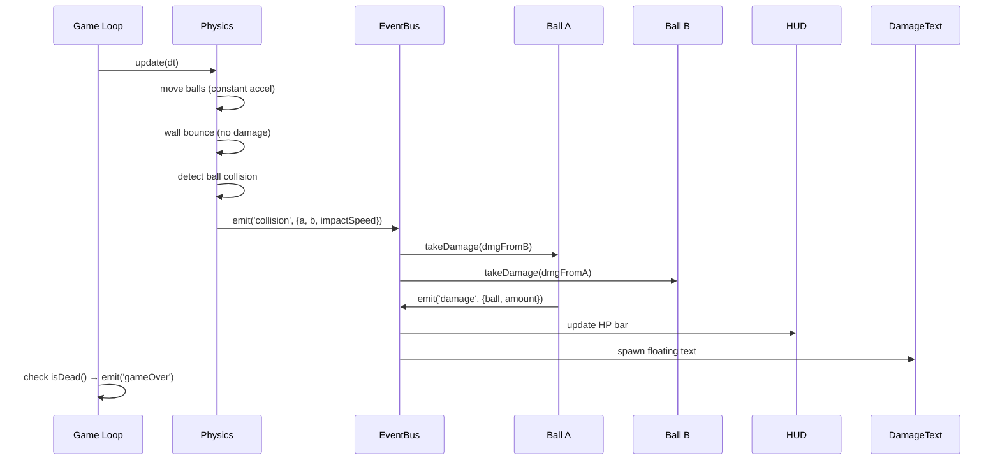
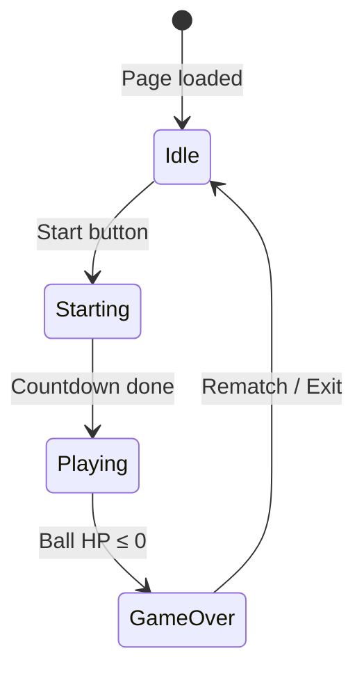

# 🎮 Balls Arena — Project Plan

> **Tổng quan dự án game 1v1 balls arena** với hệ thống kĩ năng data-driven, xây dựng trên PixiJS v8 + Vite.

---

## 1. Tầm nhìn dự án

**Balls Arena** là game 2D physics-based 1v1 trong đó 2 quả ball tự chiến đấu (AI-only). Mỗi ball được build riêng với stats, skills, skin — tạo ra vô số combo chiến thuật. Ball nào hết HP trước thì thua.

### Core loop

```
Build Ball (Builder Page) → Chọn 2 balls → Vào Arena → AI tự chiến → Kết quả
```

### Tech Stack

| Layer | Công nghệ |
|-------|-----------|
| Renderer | PixiJS v8 |
| Bundler | Vite |
| Language | JavaScript (ES Modules) |
| Storage | localStorage + JSON export/import |
| Styling | Vanilla CSS |

---

## 2. Game Rules

### Arena
- Ô vuông cố định (520×520px, có thể scale)
- 2 balls bên trong, hướng ban đầu **ngẫu nhiên**
- Gia tốc cố định được cấp liên tục → balls **luôn di chuyển**, không bao giờ dừng
- Có speed cap tránh velocity vô hạn

### Va chạm (Collision)
| Loại | Hành vi |
|------|---------|
| Ball ↔ Ball | Nảy vật lý (elastic) + **gây damage** |
| Ball ↔ Wall | Nảy vật lý, **KHÔNG gây damage** |
| Skill ↔ Ball | Tùy loại skill (damage, debuff, ...) |
| Skill ↔ Wall | Tùy skill (bị hủy hoặc nảy) |

### Damage Formula (Va chạm)
```
rawDamage = attacker.atk × impactSpeed
finalDamage = max(1, rawDamage - defender.def)
```
- `impactSpeed`: tốc độ tương đối tại thời điểm va chạm
- `defender.def`: giảm trừ damage
- Luôn gây tối thiểu 1 damage

### Win/Lose
- Ball nào **HP ≤ 0** trước → **thua**
- Hiển thị kết quả (winner, stats trận đấu)
- Có thể rematch hoặc đổi ball

---

## 3. Ball Entity

### Stats Schema

```js
{
  // === Identity ===
  id: 'ball_001',
  name: 'Inferno',
  
  // === Core Stats (set khi build) ===
  maxHp: 10000,           // Máu tối đa
  hp: 10000,              // Máu hiện tại
  atk: 100,               // Sát thương va chạm
  def: 50,                // Giảm damage nhận
  speed: 1.0,             // Hệ số tốc độ (nhân với CONSTANT_ACCEL)
  radius: 28,             // Kích thước ball
  
  // === Extended Stats (mặc định = 0, mở rộng sau) ===
  crit: 0,                // % crit chance
  critDamage: 0,          // % crit damage bonus
  lifesteal: 0,           // % HP hồi khi gây damage
  armor: 0,               // Flat damage reduction thêm
  magicPower: 0,          // Tăng damage skill
  cooldownReduction: 0,   // % giảm cooldown skill
  tenacity: 0,            // % giảm thời gian debuff
  
  // === Visual (mở rộng sau) ===
  skin: {
    fillColor: 0x818cf8,
    glowColor: 0x6366f1,
    pattern: null,         // Texture pattern
    trail: null,           // Particle trail config
  },
  
  // === Skills (mỗi ball có skill riêng, KHÔNG equip) ===
  skills: [],              // Array of skill definitions
}
```

### Methods chính

| Method | Mô tả |
|--------|--------|
| `takeDamage(amount, source, type)` | Trừ HP, apply DEF, emit event |
| `heal(amount)` | Hồi HP, cap tại maxHp |
| `applyStatusEffect(effect)` | Thêm buff/debuff |
| `removeStatusEffect(id)` | Xóa buff/debuff |
| `isDead()` | HP ≤ 0 |
| `update(dt)` | Tick status effects, skills cooldown |

---

## 4. Skill System

### Nguyên tắc thiết kế

1. **Data-driven**: Skill được định nghĩa bằng JSON, không cần code JS mới cho skill cơ bản
2. **Mỗi ball có skill riêng**: Skill gắn liền với ball khi build, không tháo lắp runtime
3. **Cooldown cố định**: Set khi build, là hằng số trong trận
4. **AI auto-cast**: Skill tự cast khi cooldown ready + điều kiện phù hợp
5. **Mở rộng dần**: Từng loại skill được implement riêng theo part

### 6 loại Skill

| # | Type | Class | Mô tả | Cast trigger |
|---|------|-------|--------|-------------|
| 1 | `buff` | BuffSkill | Tăng stats tạm thời (ATK, DEF, speed) | Cooldown ready |
| 2 | `debuff` | DebuffSkill | Gây hiệu ứng bất lợi (slow, burn, poison) | Đi kèm skill khác hoặc on-hit |
| 3 | `projectile` | ProjectileSkill | Bắn đạn hướng về enemy | Cooldown ready + trong range |
| 4 | `aoe` | AoeSkill | Gây damage vùng (explosion, shockwave) | Cooldown ready |
| 5 | `mine` | MineSkill | Rải mìn trên sàn, nổ khi enemy chạm | Tự động rải theo cooldown |
| 6 | `passive` | PassiveSkill | Hiệu ứng luôn hoạt động | Always active |

### Skill JSON Schema

```json
{
  "id": "fireball",
  "name": "🔥 Fireball",
  "description": "Bắn quả cầu lửa gây sát thương",
  "type": "projectile",
  
  "cooldown": 3000,
  "damage": 500,
  "speed": 8,
  "range": 300,
  "duration": 0,
  
  "debuff": {
    "type": "burn",
    "damage": 200,
    "duration": 4000,
    "tickRate": 1000
  },
  
  "effect": {
    "color": "0xff4500",
    "glowColor": "0xff6b35",
    "radius": 10,
    "trail": true,
    "trailLength": 8,
    "onHit": {
      "type": "explosion",
      "radius": 40,
      "color": "0xff8c00",
      "duration": 300
    }
  },
  
  "ai": {
    "castRange": 250,
    "priority": 8
  }
}
```

---

## 5. Architecture

### Module Map

```
src/
├── main.js                    ← Arena entry point
├── builder-main.js            ← Builder entry point  
├── config.js                  ← Game constants + defaults
│
├── engine/
│   ├── Game.js                ← PixiJS init, game loop, state machine
│   └── Physics.js             ← Elastic collision, wall bounce, damage calc
│
├── entities/
│   ├── Ball.js                ← Ball class (stats, HP, graphics, AI)
│   ├── Projectile.js          ← Skill projectile entity
│   └── Mine.js                ← Mine entity
│
├── skills/
│   ├── SkillBase.js           ← Abstract base class
│   ├── SkillRegistry.js       ← Load + instantiate from JSON
│   ├── SkillRunner.js         ← AI decision: khi nào cast skill nào
│   ├── types/
│   │   ├── BuffSkill.js
│   │   ├── DebuffSkill.js
│   │   ├── ProjectileSkill.js
│   │   ├── AoeSkill.js
│   │   ├── MineSkill.js
│   │   └── PassiveSkill.js
│   ├── effects/
│   │   ├── EffectBase.js
│   │   ├── ProjectileEffect.js
│   │   ├── AuraEffect.js
│   │   ├── ExplosionEffect.js
│   │   └── MineEffect.js
│   └── definitions/
│       ├── _template.json
│       └── ... (skill JSON files)
│
├── ui/
│   ├── HUD.js                 ← HP bar, skill cooldowns, ball names
│   ├── DamageText.js           ← Floating damage numbers
│   └── Builder.js              ← Ball builder page UI
│
└── utils/
    ├── EventBus.js             ← Pub/sub: on(), emit(), off()
    └── MathUtils.js            ← Vector math utilities
```

### Event Flow



### Game States



---

## 6. Builder Page

### Tính năng

| Feature | Mô tả |
|---------|--------|
| **Ball Info** | Đặt tên, chọn màu |
| **Stats Allocation** | Set ATK, DEF, Speed, HP (có thể free-form hoặc point-buy) |
| **Skills** | Gán skills cho ball (chọn từ danh sách available skills) |
| **Templates** | Preset mẫu: Tank, Fighter, Speedster, Mage |
| **Save** | Lưu vào localStorage |
| **Export/Import** | Download/upload JSON file |
| **Preview** | Xem ball graphic với skin |

### Templates mẫu

| Template | HP | ATK | DEF | Speed | Concept |
|----------|----|-----|-----|-------|---------|
| 🛡️ Tank | 15000 | 60 | 120 | 0.7 | Chịu dame, chậm |
| ⚔️ Fighter | 10000 | 150 | 50 | 1.0 | Cân bằng, dame cao |
| ⚡ Speedster | 7000 | 80 | 30 | 1.8 | Nhanh, mỏng |
| 🔮 Mage | 8000 | 50 | 40 | 1.0 | Dame từ skills |

---

## 7. Development Roadmap

### Part 1: Core Engine ⬅️ LÀM TRƯỚC

**Mục tiêu**: 2 balls chạy trong arena, va chạm gây damage, HP bar, win/lose

| # | Task | Files |
|---|------|-------|
| 1.1 | Setup Vite + npm + PixiJS | `package.json`, `vite.config.js` |
| 1.2 | Config + Utils | `config.js`, `EventBus.js`, `MathUtils.js` |
| 1.3 | Ball entity | `Ball.js` |
| 1.4 | Physics engine | `Physics.js` |
| 1.5 | Game orchestrator | `Game.js` |
| 1.6 | HUD (HP bars) | `HUD.js` |
| 1.7 | Damage text | `DamageText.js` |
| 1.8 | Entry point | `main.js` |
| 1.9 | Update HTML + CSS | `index.html`, `style.css` |

**Output**: Game chơi được, 2 balls đánh nhau bằng va chạm vật lý

---

### Part 2: Skill Infrastructure

**Mục tiêu**: Framework skill hoàn chỉnh, 6 type classes (stub), JSON schema

| # | Task | Files |
|---|------|-------|
| 2.1 | SkillBase abstract class | `SkillBase.js` |
| 2.2 | SkillRegistry (load JSON) | `SkillRegistry.js` |
| 2.3 | SkillRunner (AI logic) | `SkillRunner.js` |
| 2.4 | 6 skill type stubs | `types/*.js` |
| 2.5 | Skill JSON template | `definitions/_template.json` |
| 2.6 | Effect base classes | `effects/*.js` |

**Output**: Skill system sẵn sàng, chưa có skill cụ thể hoạt động

---

### Part 3: Builder Page

**Mục tiêu**: Trang riêng tạo/edit ball, save/load, templates

| # | Task | Files |
|---|------|-------|
| 3.1 | Builder HTML page | `builder.html` |
| 3.2 | Builder UI logic | `Builder.js`, `builder-main.js` |
| 3.3 | Templates preset | Trong Builder.js |
| 3.4 | Save/Load localStorage | Trong Builder.js |
| 3.5 | Export/Import JSON | Trong Builder.js |
| 3.6 | Arena load from saved balls | Update `main.js` |

**Output**: Tạo ball custom → save → load vào arena chiến

---

### Part 4: Implement Skills

**Mục tiêu**: Từng skill cụ thể hoạt động

| # | Task |
|---|------|
| 4.1 | ProjectileSkill: Fireball, Ice Shard |
| 4.2 | BuffSkill: Rage, Speed Boost |
| 4.3 | AoeSkill: Shockwave, Explosion |
| 4.4 | MineSkill: Poison Mine, Shock Trap |
| 4.5 | PassiveSkill: Regen, Thorns |
| 4.6 | DebuffSkill: Burn, Slow, Stun |

---

### Part 5: Visual Effects

| # | Task |
|---|------|
| 5.1 | Projectile trail particles |
| 5.2 | Explosion animation |
| 5.3 | Aura pulse effect |
| 5.4 | Mine glow + trigger animation |
| 5.5 | Screen shake on big hits |
| 5.6 | Status effect visual indicators |

---

### Part 6: Skin System

| # | Task |
|---|------|
| 6.1 | Custom colors + gradient |
| 6.2 | Pattern textures |
| 6.3 | Particle trail config |
| 6.4 | Skin picker trong Builder |

---

### Part 7: Polish

| # | Task |
|---|------|
| 7.1 | Sound effects |
| 7.2 | Match history + stats tracking |
| 7.3 | Tournament mode (best of 3) |
| 7.4 | Spectator controls (pause, speed) |
| 7.5 | Responsive design |

---

## 8. File Summary

| Tổng files (all parts) | ~35 files |
|------------------------|-----------|
| Part 1 | 12 files mới + 2 modify + 1 delete |
| Part 2 | 10 files mới |
| Part 3 | 3 files mới + 1 modify |
| Part 4-7 | Modify existing + thêm definitions |
